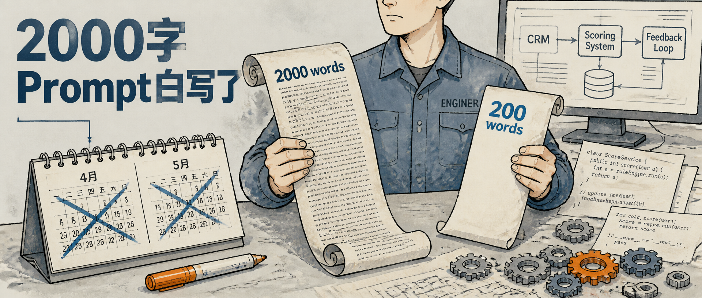
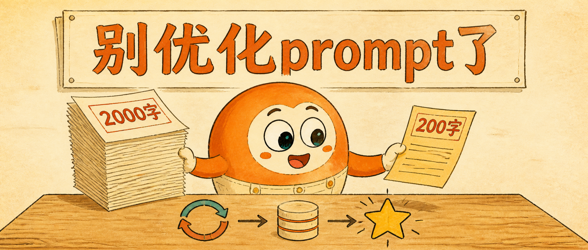
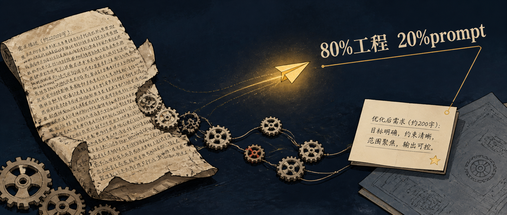
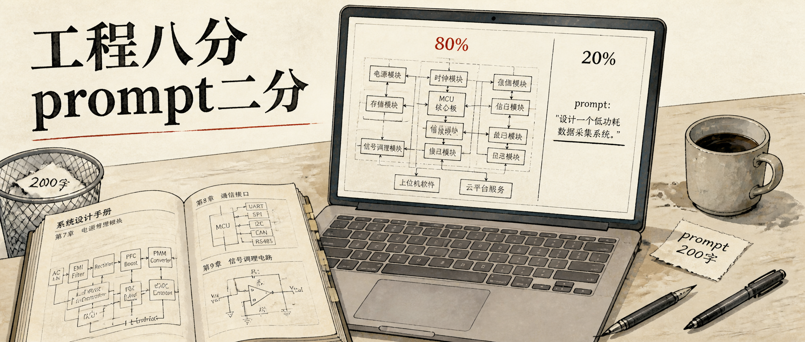

# wechatcover-skill

> 通用的**中文公众号封面图生成 skill**。给一篇文章，自动产出一张有设计感、品牌一致、中文文字渲染正确的封面图。

三步走：**设计哲学 → LLM 艺术指导 → GPT-Image-2 出图**。把反复打磨过的视觉方法论 + 可工程化的出图链路，打包成一个 [Claude Code](https://claude.com/claude-code) 可直接调用的 skill，也能当独立 CLI 用。fork 后改 `brand_system.md` 就是你自己的封面生成器。

成本 ~¥0.02/张（省钱版），Node ≥ 18。封面 CLI 与 Web UI 出图均零依赖；只有「导出微信排版 HTML」需 `npm install`。

---

## 风格预设（Showcase）

五套风格，**同一篇样例文章**出图，用 `--brand-system` 一键切换。下面都是本 skill 的真实产出（1920×816，省钱版）。

### 默认：暖纸蓝（warm paper + blue）
温和的锋利——暖纸阅读底 + 深海蓝精确签名 + 砖橘点睛，带青椒 IP。


```bash
node gen_cover.mjs --from-text article.md --out cover.png --with-character
```

### 冷工业灰（cold industrial）
科技公司 / 产品发布——混凝土冷灰 + 钢蓝 + 工业安全橙点睛。默认无 IP。



```bash
node gen_cover.mjs --from-text article.md --out cover.png --brand-system presets/cold-industrial.md
```

### 暖橘活泼（warm orange）
个人 newsletter / 生活方式——暖奶油底 + 暖橘 + 鸭青互补点睛。可选友好吉祥物。



```bash
node gen_cover.mjs --from-text article.md --out cover.png --brand-system presets/warm-orange.md --with-character
```

### 深色编辑风（dark editorial）
观点 / 深度长文——深墨底（非纯黑）+ 暖金发光 + 朱红点睛。默认无 IP。



```bash
node gen_cover.mjs --from-text article.md --out cover.png --brand-system presets/dark-editorial.md
```

### 学术纯排版（academic）
深度长文 / 论述——暖纸大留白 + 单色墨 + 印章朱红单点睛，排版即设计。无 IP。



```bash
node gen_cover.mjs --from-text article.md --out cover.png --brand-system presets/academic.md
```

---

## 它解决什么

中文公众号写作者每篇文章都要做封面，但：
- 设计 SaaS（Lovart / Ideogram 等）按张收费，且不懂中文设计语言
- 自己写 prompt 调 Midjourney / GPT-Image-2，要 N 次才出能看的图
- 没有持续的品牌一致性，每篇风格漂移

这个 skill 把「怎么想一张好封面」固化成可复用的方法论，把「怎么稳定出图」固化成一条命令。

## 安装

封面生成（CLI + Web UI 出图）零依赖、无需 `npm install`（Node 18+ 内置 fetch）。只有 Web UI 的「导出微信排版 HTML」用到 `markdown-it` + `juice`，用前 `npm install` 一次即可。

```bash
git clone https://github.com/naplesblue/wechatcover-skill.git
cd wechatcover-skill
cp .env.example .env     # 填入下面两个 key
```

`.env`：

```
OPENAI_API_KEY=sk-xxxx       # GPT-Image-2 出图（必需）
DEEPSEEK_API_KEY=sk-xxxx     # 艺术指导（必需，也可换 Qwen）
```

## 快速上手

```bash
node gen_cover.mjs --from-text examples/sample_bear_article.md --out covers/my-cover.png

# 带 IP 角色：       --with-character
# 换风格预设：       --brand-system presets/dark-editorial.md
# 先看艺术指导不出图：--preview
# 出图前先看构图线框：--wireframe
```

跑完会输出图片路径，并在旁边存一份 `.meta.json`（完整的钩子 / 画面构想 / image_prompt 记录，方便复盘和微调）。

## 本地 Web UI

不想敲命令？起一个本地网页，粘贴文章就出图（适合从 Bear / 备忘录直接复制正文，无需导出 .md）。

```bash
npm start              # 然后打开 http://localhost:8787（等同 node server.mjs）
```

- 粘贴 Markdown（第一行 `# 标题`）→ 选风格（出图后端、模型、API Key 都在「设置」里）→ 出封面。三个入口：
  - **先看构图（推荐）**：先只跑艺术指导，列出 3 种不同版式的**构图线框**（标题 / 焦点 / 辅助 / 点睛 / 留白 分区，不花出图钱）；挑中一个点「按此构图出图」按这份锁定的构图出图，还能选「出 N 张」连出变体——**先定版式、再出图**
  - **直接生成封面**：跳过构图，直接出 1 张
  - **只出提示词**：只跑艺术指导、不出图，给出可复制的英文 image_prompt——拿去网页版 LLM 自己出图，省一个生图 key
- **同提示词重出**：对某张封面用同一份提示词再出一张（不重跑艺术指导、更省），适合「创意满意但这张有瑕疵」
- 顺手「微信排版」（右上角）：把同一篇正文转成可直接粘进公众号编辑器的内联样式 HTML（markdown-it + juice，完整 markdown：表格 / 图片 / 嵌套列表 / 删除线）
- 服务器是 Node 原生 http；出图走同一条 `gen_cover` 链路（含中文渲染质检 + 版式坐标兜底）。出图无需依赖，**排版导出前先 `npm install` 一次**
- 没配 key 时点出图会弹窗提醒（缺哪个提示哪个）。key 可在页面「设置」里填——即时生效、存本机浏览器、覆盖 `.env`
- ⚠️ **`.env` 只在 server 启动时读一次**：改了 `.env` 里的 key 要**重启 server** 才生效（或直接用页面「设置」填 key，免重启）。同理改了 `server.mjs` / `lib/` 也要重启（改 `index.html`、`gen_cover.mjs` 不用——前者每次请求重读、后者每次新起子进程）
- Web UI **不含 IP 角色**——它是进阶玩法，走命令行 `--with-character`（见下方「IP 角色（进阶）」）

## CLI 参数

| 参数 | 默认 | 说明 |
|---|---|---|
| `--from-text <path>` | （必填） | 输入文章 markdown（自动提取标题 + 正文摘要）|
| `--out <path>` | `covers/{slug}-{timestamp}.png` | 输出图片路径 |
| `--brand-system <path>` | `brand_system.md` | 品牌配置文件（切换风格预设）|
| `--with-character` | 关 | （进阶，仅 CLI）启用 brand_system 定义的 IP 角色（默认风格=青椒；多数预设无 IP）。详见「IP 角色（进阶）」 |
| `--ip-image a.png,b.png` | 无 | （进阶）IP 角色**参考图**（逗号分隔多张），走 OpenAI edits 端点让角色按参考图**自然融合**进画面，比纯文字更稳。隐含开启角色；仅 `--provider openai`。**需配一个「IP 角色规范」描述与参考图一致的 brand_system**（见「IP 角色（进阶）」）|
| `--subtitle "..."` | 空 | 角落小字（如网址 + 日期）；不传则不渲染 |
| `--quality low\|medium\|high` | `low` | 出图画质 |
| `--size 1920x816\|2400x1024` | `1920x816` | 尺寸（均为公众号首图 47:20）|
| `--provider openai\|qwen` | `openai` | 出图后端（也可 `IMAGE_PROVIDER`）。`qwen`=通义千问 Qwen-Image（中文渲染强），需 `DASHSCOPE_API_KEY`（国内可支付宝充值）|
| `--variants N` | `1` | 一次出 N 个不同钩子/构图候选（输出 `-1.png … -N.png`）|
| `--diverse-layouts` | 关 | 配合 `--variants N`（N>1）：让各候选尽量用不同版式 pattern，便于横向对比构图 |
| `--model <id>` | `deepseek-v4-flash` | 艺术指导模型（也可用 `GEN_COVER_MODEL` 环境变量）|
| `--effort low\|high\|max` | `high` | 推理强度（仅 deepseek 生效，映射为 `reasoning_effort`）|
| `--no-qa` / `--qa-retries N` | QA 开 / `1` | 中文标题渲染质检（默认开，糊字自动重出）|
| `--preview` | 关 | 只做艺术指导、打印 JSON，不调出图 API |
| `--wireframe` | 关 | 出图前先生成 HTML 版式线框图（`{out}.wireframe.html`）确认构图，不出图；同时写出锁定提示词 `{out}.prompt.txt` 供随后出图 |
| `--force` | 关 | 覆盖已存在的输出文件 |

## 做你自己的品牌

设计分两层：**设计哲学**（通用，不用改）和**品牌配置**（每个品牌不同）。

| 文件 | 作用 |
|---|---|
| `art_director.md` | 设计哲学 + 三步法。**通用，fork 时不用动。** |
| `brand_system.md` | 默认品牌配置（暖纸蓝 + 青椒 IP），开箱即跑 |
| `brand_system.template.md` | 模板骨架，带占位和注释 —— **fork 时复制改这个** |
| `brand_system.example.md` | 填好的样例（带说明），对照着改 |
| `presets/*.md` | 现成的可切换风格（冷工业灰 / 暖橘活泼 / 深色编辑风 / 学术纯排版 / risograph 中世纪 / 简洁科技玻璃卡）|

定制流程：复制 `brand_system.template.md` → 改色板、字体、IP 角色、调性映射 → 用 `--brand-system 你的文件.md` 调用。色板比例结构（一个 ≥50% 主导色 + 精确签名色 + 单一点睛色）和视觉黑名单建议保留。

## IP 角色（进阶）

IP 角色有**两种**用法：

**1) 纯文字（`--with-character`）** — 角色长相由 brand_system「IP 角色规范」的**文字描述**决定。具体出谁看当前风格：

| 风格 | `--with-character` 的角色 |
|---|---|
| 暖纸蓝（默认）| 青椒 IP（海蓝毛衣 + 眼镜人 + 肩上拟人青椒）|
| 暖橘活泼 | 圆润友好的橘色吉祥物 |
| 冷工业灰 / 深色编辑风 / 学术纯排版 | 无 IP（忽略此参数）|

纯文字方式多次生成的长相不完全一致（描述只能定大方向）。

**2) 参考图（`--ip-image`，推荐）** — 给一张（或几张）角色参考图，走 OpenAI edits 端点让角色**按参考图自然融合**进画面，长相稳得多：

```bash
node gen_cover.mjs --from-text article.md --brand-system 你的IP风格.md \
  --ip-image path/to/mascot.png
```

- **关键**：参考图要配一个「IP 角色规范」**与参考图一致**的 brand_system。因为艺术指导 LLM 是纯文本、看不到图——brand_system 要给个**最小身份**（如「一只辣椒吉祥物」）防它瞎编，并**只写动作/情绪、不硬规定外观**（外形 100% 交给参考图）。写法见 `brand_system.template.md` 的「IP 角色规范」注释。
- 仅 `--provider openai`（edits 端点）。可传多张（逗号分隔）。
- 角色定义 / 参考图都在你自己的 brand_system / `private/` 里——fork 改了就是你自己的角色。

## 设计哲学

真正的资产在 `art_director.md`，几条反复验证过的原则：

- **语域分治（信息 vs 情绪）**：先判断内容语域——信息/科技类走清晰、可上数字大字；情绪/人文类走氛围、克制、抽象，**封面不上标语**（标题交给文章标题）。手法服从语域，而非一刀切。
- **数字钩子优先（信息类）**：封面是 1.5 秒注视产品。信息类文章里有具体数字（金额、百分比、量级）时，数字钩子优先级最高——别用「概念性钩子」替代。
- **画布统一性 > 局部均衡**：横图不是「左中右三段平衡」，是「整张画布作为一个被设计的整体」。没有飞地（floating island），没有死区（forgotten corner）。
- **版式先行（先定构图再出图）**：把「东西摆哪」从图像模型的即兴里收回来——先在 3×3 三分网格上定 `layout`（标题区 / 焦点 / 辅助 / 点睛 / 留白 + 视线流，从 5 种版式 playbook 里选），再据此翻译出 prompt 的 COMPOSITION 段。Web UI 的「先看构图」能在出图前肉眼审版式（详见 `art_director.md` Step 2.5）。
- **设计原则 > 具体路径**：约束停在原则层。给 LLM 原则它会找到合适的实现路径；给 LLM 模板它会退化为复制。
- **反 AI 视觉俗套黑名单**：显式禁止抽象神经网络、发光的脑子、机器手握人手、电路板背景、二进制雨、镜面塑料光泽……这些是 GPT-Image-2 默认会吐的「AI 出图模板」，必须强制禁用。

## 工作原理

```
文章 → DeepSeek 艺术指导（找钩子 → 设计画面 → 定版式 → 写 prompt）→ layout + image_prompt
     → GPT-Image-2 单次渲染（含中文标题）→ 封面 PNG + meta.json
```

三个踩过的坑（已固化进流程）：
- **中文文字单次渲染**：不做「base 图 + 文字 overlay」双层 pipeline，直接在 prompt 里指定中文标题。GPT-Image-2 实测对长 prompt（1000+ 字符）和中文标题渲染稳定。
- **不写真品牌名**：真实公司名 / 商标 / 出版物 / 艺术家名会触发 OpenAI 安全审核，或渲染出真实 logo（公众号发布有商标风险）。一律用 generic 描述（`a major tech company's display`）。
- **版式坐标兜底**：LLM 偶尔写出非法网格坐标（会让标题/焦点直接画不出来）。代码会校验渲染核心区（标题区 + 各元素）的坐标，带着具体错误让 LLM 重出（最多 2 次），仍不过则优雅降级——所以「先看构图」看到的线框基本不会缺块。

## 成本

| 档位 | 分辨率 | GPT-Image-2 | 约合人民币 |
|---|---|---|---|
| `low`（默认）| 1920×816 | ~$0.003 | ~¥0.02 |
| `medium` | 2400×1024 | ~$0.032 | ~¥0.24 |
| `high` | 2400×1024 | ~$0.21 | ~¥1.5 |

外加 DeepSeek 艺术指导每次约 $0.005。editorial illustration 风格对像素细节不敏感，**日常用默认 low 即可**，必要时再上高清。

## 依赖

- Node.js ≥ 18（内置 fetch；封面生成无需 `npm install`）
- 可选：`markdown-it` + `juice`（仅 Web UI 的「导出微信排版 HTML」需要，`npm install` 装上）
- 出图：OpenAI API key（GPT-Image-2，默认）**或** DashScope key（通义千问 Qwen-Image，`--provider qwen`，国内可支付宝充值、免外卡、中文渲染强）
- 艺术指导：DeepSeek API key（也可换 Qwen / DashScope，见 `lib/llm.mjs`）

## 来源

从 [ai_morning_brief](https://github.com/naplesblue/ai_morning_brief)（中文 AI 日报）剥离而来。这个 skill 在原项目里通过几十轮迭代打磨，上面的设计哲学和踩坑都是真实经验。本仓库已完成与原项目的解耦，独立演进。

## License

[MIT](LICENSE) © naplesblue

欢迎贡献，见 [CONTRIBUTING.md](CONTRIBUTING.md)。
